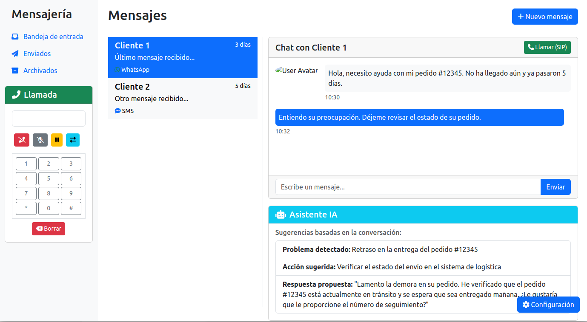

# Softphone SIP con Asistente AI

Este proyecto implementa un softphone SIP con un asistente de inteligencia artificial integrado.

## Características principales

- Realiza y recibe llamadas SIP
- Interfaz de usuario intuitiva
- Asistente AI para sugerencias durante las llamadas
- Configuración personalizable de la cuenta SIP

## Captura de pantalla

## Instalación

1. Clona este repositorio
2. Abre `index.html` en tu navegador web

## Uso

1. Configura tu cuenta SIP en la sección de ajustes
2. Utiliza el teclado para marcar un número
3. Inicia la llamada y observa las sugerencias del asistente AI

## Tecnologías utilizadas

- HTML5
- CSS3 (Bootstrap)
- JavaScript
- SIP.js para la comunicación SIP

## Contribuciones

Las contribuciones son bienvenidas. Por favor, abre un issue para discutir los cambios propuestos.

## Licencia

Este proyecto está bajo la Licencia MIT. Consulta el archivo `LICENSE` para más detalles.
